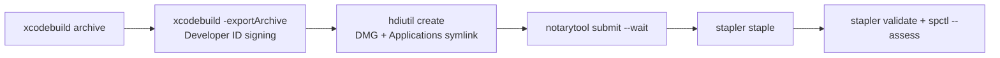

A single script that turns the current checkout into a distributable app:
archive with `xcodebuild`, export with the `Developer ID Application: Sebastian
Suarez (KGVLNXZJNX)` identity, package the app into a DMG with an
`/Applications` symlink, submit it to `notarytool`, wait for the ticket, staple
it and verify the result with `spctl`/`stapler`. The hardened runtime is already
on and the App Sandbox stays off (see `.project/memory/app-sandbox-disabled.md`)
— Developer ID + notarization is exactly the distribution path that setting
implies. The version to build comes from the invocation, not from a hardcoded
value, so the same script serves CI later.

Notarization credentials are the one thing the script cannot create: it must
read them from a `notarytool` keychain profile (or App Store Connect API key
env vars in CI) and fail with a clear message telling the user how to store one,
never by hanging or printing a raw Apple error.

- [x] One command produces a signed, notarized, stapled DMG from a clean checkout
- [x] The exported app is signed with the Developer ID identity and the hardened runtime, verified by `codesign --verify --deep --strict` and `spctl --assess`
- [x] The DMG passes `stapler validate` and mounts to show the app plus an `/Applications` symlink
- [x] Version and build number are set from the script's argument, not edited by hand
- [x] Missing or invalid notarization credentials fail fast with instructions instead of a stack trace
- [x] The release procedure (credential setup included) is documented in the README

## Plan

> Implemented on `build/release-script`, cut from `main` at `f3e1213` (adds
> this milestone's item files; includes the app icon, merged via PR #5 —
> `28b60d5`/`c6b7f4f` — moments before this plan was written, so the
> "icon not on main yet" sequencing risk flagged during planning is already
> resolved and does not carry into this plan). No child Task files: this
> story is one coherent unit of work, sized like M01-S01/S02/S03 (all
> Stories, all implemented directly with no Task breakdown — same call here).

### Approach

**One self-contained script, `scripts/release.sh <version> [build]`,** doing
archive → export → package → notarize → staple → verify. It is the only place
signing/notarization logic lives; M02-S02 will call it verbatim from CI and
must not reimplement any of it.

Key decisions, each with the alternative rejected:

- **Version/build via `xcodebuild` command-line overrides
  (`MARKETING_VERSION=`, `CURRENT_PROJECT_VERSION=`), never by editing
  `project.pbxproj` or writing an `Info.plist`.** The project already
  generates its Info.plist at build time (`GENERATE_INFOPLIST_FILE = YES`,
  `INFOPLIST_KEY_LSUIElement = YES` — confirmed there is no `Info.plist` file
  on disk anywhere in the repo); command-line build-setting overrides flow
  into that generated plist without mutating a single tracked file. Rejected:
  `agvtool`/`PlistBuddy` mutating the pbxproj, or hand-editing before each
  release — both leave a diff to remember to revert and directly contradict
  AC4 ("not edited by hand").
- **Build number defaults to `git rev-list --count HEAD`** when the optional
  second argument is omitted — deterministic (same commit always yields the
  same number), monotonic across commits, and needs no state file. An
  explicit second argument always overrides it.
- **DMG via plain `hdiutil create -format UDZO`,** no background image or
  icon-position styling. Matches the user's "no new dependencies" instruction
  (rejects `create-dmg`/`appdmg` npm tooling) and the acceptance criteria,
  which only require the app plus an `/Applications` symlink — visual
  polish is an explicit non-goal, open for a future story if wanted.
- **Notarize the DMG directly, not the `.app` separately.** This is Apple's
  own documented "notarize a disk image" flow, needs exactly one
  `notarytool submit --wait` round-trip (each is several minutes), and
  matches the acceptance criteria's literal wording — AC3 says the *DMG*
  passes `stapler validate`. Rejected: zip-and-notarize the `.app`, staple
  the `.app`, *then* also build/notarize/staple the DMG — doubles wait time
  for no behavioral gain for a simple drag-to-Applications installer.
- **Credentials: keychain profile locally, App Store Connect API key in CI**
  — both supported from the start via the same auth-resolution function, so
  M02-S02 needs zero new script logic, only secrets. Env var/name contract
  (fixed now so S02 can build against it without guessing):
  `NOTARY_PROFILE` (default `AI-usage-notary`) for the local path;
  `ASC_KEY_PATH` / `ASC_KEY_ID` / `ASC_ISSUER_ID` (all three set → API-key
  path, takes priority over `NOTARY_PROFILE`) for CI.
- **Export signing: `method: developer-id`, `signingStyle: automatic`,
  `teamID: KGVLNXZJNX` in a static `ExportOptions.plist` — no hardcoded
  certificate hash.** Automatic resolution by team is what `CODE_SIGN_STYLE
  = Automatic` already does for Debug builds; hardcoding the identity's SHA
  would silently break on the next certificate renewal. The archive step
  itself doesn't need a matching override — whatever identity Automatic
  signing picks for the `.xcarchive` is irrelevant, because
  `-exportArchive` re-signs from scratch per the export options. No
  provisioning profile is specified because Developer ID distribution
  outside the Mac App Store doesn't need one for a non-sandboxed app; if
  export ever fails on a provisioning error, the fix is `-allowProvisioningUpdates`,
  not a bigger redesign.
- **No new checked-in Xcode scheme.** There is no `.xcscheme` file anywhere
  in the repo (not even in the gitignored `xcuserdata/` — only an empty
  `xcschememanagement.plist` recording the autocreated scheme's order hint).
  `xcodebuild -list` already resolves scheme `AI usage` from the single app
  target with nothing on disk, and M01-S02/S03's own CLI build/test commands
  already rely on exactly this. Rejected: hand-authoring `.xcscheme` XML
  preemptively — real risk of getting the Archive/Test action XML subtly
  wrong, for a problem not yet observed. Step 1 below tests archiving from
  an actual fresh clone specifically to catch it if this assumption is
  wrong; see Risks.
- **Tests: `AI usageTests` only, not `AI usageUITests`, gate the release
  before archiving.** Matches the M01 CLI precedent (`-only-testing:"AI
  usageTests"`); UI tests need an interactive session and are slow/flaky
  headless, worse for a menu-bar-only app with no main window
  (`INFOPLIST_KEY_LSUIElement = YES`). Not an oversight — call this settled
  if a reviewer flags it.
- **`ditto`, not `cp -R`, to copy the exported `.app` into DMG staging (and
  into the scratch copy used for the Gatekeeper check).** `ditto` is the
  Apple-recommended way to duplicate a signed bundle without risking dropped
  extended attributes/resource forks that `cp -R` can occasionally mangle —
  a code signature silently invalidated by the copy step would be a nasty,
  hard-to-trace failure mode to hand to M02-S02.

### Files to touch

- `scripts/release.sh` — new. Executable (`chmod +x`). The whole pipeline;
  see Steps for its exact phases and commands.
- `scripts/ExportOptions.plist` — new, static:

  ```xml
  <?xml version="1.0" encoding="UTF-8"?>
  <!DOCTYPE plist PUBLIC "-//Apple//DTD PLIST 1.0//EN" "http://www.apple.com/DTDs/PropertyList-1.0.dtd">
  <plist version="1.0">
  <dict>
      <key>method</key>
      <string>developer-id</string>
      <key>teamID</key>
      <string>KGVLNXZJNX</string>
      <key>signingStyle</key>
      <string>automatic</string>
  </dict>
  </plist>
  ```
- `README.md` — new "📦 Release" section (prerequisites, one-line command,
  where the DMG lands) with a small Mermaid `flowchart` of the pipeline. Not
  a data-flow/architecture change, so the existing "How it works" diagram is
  untouched — this is an additive section in the same documentation-style
  spirit (Mermaid over prose for structure).
- Do **not** touch: `AI usage.xcodeproj/project.pbxproj` (no version bump,
  no scheme changes — see Approach), any file under `AI usage/` (app
  source), `.gitignore` (`build/` is already ignored wholesale, so
  `build/release/**` needs no new entry).

### Steps

Every step is runnable and checkable on its own; later steps depend on
earlier ones completing. `DEVELOPER_DIR` defaults inside the script itself
(`: "${DEVELOPER_DIR:=/Applications/Xcode.app/Contents/Developer}"`) so
callers don't need to remember the CommandLineTools gotcha from M01.

1. **Scaffold** `scripts/release.sh` (shebang, `set -euo pipefail`, a usage
   string, positional-arg parsing for `<version> [build]`) and
   `scripts/ExportOptions.plist` (content above).
   Verify: `chmod +x scripts/release.sh`; running it with zero arguments
   prints usage and exits non-zero without an "unbound variable" crash.
2. **Argument + tool preflight.** Validate `version` against
   `^[0-9]+\.[0-9]+(\.[0-9]+)?$`; if a second arg is given validate
   `^[0-9]+$`, else default `build="$(git rev-list --count HEAD)"`. Check
   `command -v xcodebuild hdiutil codesign spctl ditto` and `xcrun --find
   notarytool`/`xcrun --find stapler` all resolve.
   Verify: `scripts/release.sh not-a-version` fails fast with a clear
   message and does nothing else (no directories created).
3. **Notarization credential preflight** (must run before any expensive
   work). Resolution order: if `ASC_KEY_PATH`, `ASC_KEY_ID` and
   `ASC_ISSUER_ID` are all set, use `--key "$ASC_KEY_PATH" --key-id
   "$ASC_KEY_ID" --issuer "$ASC_ISSUER_ID"` (and check the key file exists).
   Otherwise use `--keychain-profile "${NOTARY_PROFILE:-AI-usage-notary}"`
   and probe it with `xcrun notarytool history --keychain-profile "$NOTARY_PROFILE" >/dev/null 2>"$err"`;
   on failure, print:

   ```
   No notarization credentials found for "AI usage".

   Local (one-time setup): create a keychain profile notarytool can reuse:
     xcrun notarytool store-credentials "AI-usage-notary" \
       --apple-id "<your-apple-id-email>" \
       --team-id "KGVLNXZJNX" \
       --password "<app-specific password from appleid.apple.com>"

   CI: set ASC_KEY_PATH, ASC_KEY_ID and ASC_ISSUER_ID to an App Store
   Connect API key (.p8 file path, key ID, issuer ID) instead.
   ```

   then exit 1. Never let a missing/wrong profile fall through to
   `notarytool submit` and surface Apple's own error.
   Verify (reproducible right now — no profile exists on this Mac yet):
   run the script end to end with `NOTARY_PROFILE=does-not-exist` and no
   `ASC_*` vars set → exits non-zero within a few seconds, prints exactly
   the message above, no `build/release/` directory created.
4. **Clean workspace**: `rm -rf build/release && mkdir -p
   build/release/{archive,export,dmg,logs}`.
   Verify: directories exist and are empty.
5. **Pre-release test gate**: run `AI usageTests` only —
   `xcodebuild test -project "AI usage.xcodeproj" -scheme "AI usage"
   -destination 'platform=macOS' -only-testing:"AI usageTests"` (mirrors the
   M01-S02 command). `set -e` means a failing suite stops the pipeline
   before archiving.
   Verify: run today (all M01 tests are green per M01's closure) → exits 0
   and the script proceeds.
6. **Archive**: `xcodebuild archive -project "AI usage.xcodeproj" -scheme
   "AI usage" -configuration Release -archivePath
   build/release/archive/AIUsage.xcarchive MARKETING_VERSION="$VERSION"
   CURRENT_PROJECT_VERSION="$BUILD"`.
   Verify: the `.xcarchive` exists; `Products/Applications/AI usage.app/Contents/Info.plist`
   inside it has `CFBundleShortVersionString` == `$VERSION` and
   `CFBundleVersion` == `$BUILD` (`/usr/libexec/PlistBuddy -c "Print
   :CFBundleShortVersionString"` / `:CFBundleVersion`) — this is the direct
   proof for AC4, together with a `git status`/`git diff` on
   `project.pbxproj` showing no changes.
7. **Export**: `xcodebuild -exportArchive -archivePath
   build/release/archive/AIUsage.xcarchive -exportPath build/release/export
   -exportOptionsPlist scripts/ExportOptions.plist`.
   Verify: `build/release/export/AI usage.app` exists.
8. **Verify signature + hardened runtime** (first half of AC2):
   `codesign --verify --deep --strict --verbose=2 "build/release/export/AI usage.app"`
   and confirm `codesign -dvv "build/release/export/AI usage.app" 2>&1`
   shows `Authority=Developer ID Application: Sebastian Suarez (KGVLNXZJNX)`
   and `flags=0x10000(runtime)`.
   Verify: both commands exit 0; grep for both strings in the `-dvv` output.
9. **Stage and build the DMG**: fresh staging dir, `ditto "build/release/export/AI usage.app" "$STAGING/AI usage.app"`,
   `ln -s /Applications "$STAGING/Applications"`, then `hdiutil create
   -volname "AI usage" -srcfolder "$STAGING" -ov -format UDZO
   "build/release/AI-usage-$VERSION.dmg"`.
   Verify: the DMG file exists and is non-trivially sized (> a few MB).
10. **Submit for notarization and wait**: pick the auth args from step 3,
    then `xcrun notarytool submit "build/release/AI-usage-$VERSION.dmg"
    "${AUTH_ARGS[@]}" --wait --output-format json | tee
    build/release/logs/submit.json`. Parse `status`/`id` with
    `python3 -c "import json,sys; d=json.load(sys.stdin); print(d['status'])"`
    (macOS ships python3; no new dependency). If status != `Accepted`: run
    `xcrun notarytool log "$ID" "${AUTH_ARGS[@]}" build/release/logs/log.json`,
    `cat` it to stderr, exit 1 — this is the "surface the submission log on
    failure" behavior instead of a bare non-zero exit.
    Verify: once a real `AI-usage-notary` profile exists (see Risks — this
    is the one step that needs the user's one-time setup action), a run
    against the real DMG returns `status: Accepted`.
11. **Staple and validate**: `xcrun stapler staple
    "build/release/AI-usage-$VERSION.dmg"` then `xcrun stapler validate
    "build/release/AI-usage-$VERSION.dmg"` (this is AC1 and AC3's "passes
    stapler validate").
    Verify: `stapler validate` exits 0 with an "accepted"/"worked" message.
12. **Final mount + Gatekeeper check** (AC3's mount content check, AC2's
    `spctl --assess` half): `hdiutil attach -readonly -nobrowse -mountpoint
    "$MNT" "build/release/AI-usage-$VERSION.dmg"`; confirm `"$MNT/AI
    usage.app"` is a directory and `"$MNT/Applications"` is a symlink;
    `hdiutil detach "$MNT"`. Then `ditto` a scratch copy of the exported
    `.app`, tag it with a synthetic quarantine attribute (`xattr -w
    com.apple.quarantine "0083;$(printf '%x' "$(date +%s)");Safari;"
    "$SCRATCH_APP"` — this is what actually makes Gatekeeper run the full
    notarization check instead of the lenient no-quarantine path a plain
    local build gets) and run `spctl --assess --type execute --verbose=4
    "$SCRATCH_APP"`.
    Verify: mount check passes; `spctl` output contains `accepted` and
    `source=Notarized Developer ID`.
13. **README**: add the section below (Files to touch has the exact
    content) right after "🚀 Getting started".
    Verify: Mermaid renders; the profile name, env var names, and command
    match the script's actual defaults exactly (copy-paste from the README
    must work verbatim).

README addition (step 13), exact content:

````markdown
## 📦 Release

`scripts/release.sh` turns a checkout into a signed, notarized DMG anyone can
install with Gatekeeper's blessing — the same script runs here and in CI
(see M02-S02).

### One-time setup

The Developer ID signing certificate must already be in your keychain.
Notarization needs its own credentials, stored once:

    xcrun notarytool store-credentials "AI-usage-notary" \
      --apple-id "<your-apple-id-email>" \
      --team-id "KGVLNXZJNX" \
      --password "<app-specific password from appleid.apple.com>"

(CI uses an App Store Connect API key instead — `ASC_KEY_PATH`, `ASC_KEY_ID`,
`ASC_ISSUER_ID`.)

### Cutting a release

    scripts/release.sh 1.1.0

produces `build/release/AI-usage-1.1.0.dmg` — archived, signed with the
Developer ID identity, packaged with an `/Applications` symlink, notarized
and stapled.


````

### Test plan

Mapped to the acceptance criteria checklist:

- **AC1 (one command, clean checkout → signed/notarized/stapled DMG)**:
  Steps 1–12 chained is exactly this command. Reproduce independently by
  cloning the branch into a scratch directory (`git clone . /tmp/aiusage-clean
  && cd /tmp/aiusage-clean && git checkout build/release-script`) and running
  `scripts/release.sh 0.0.1-test` there — this is also the concrete proof
  that the implicit/autocreated Xcode scheme (no `.xcscheme` file exists,
  see Approach) resolves correctly with zero local Xcode state.
- **AC2 (Developer ID + hardened runtime, codesign + spctl)**: Step 8's
  `codesign --verify --deep --strict` plus Authority/flags grep; Step 12's
  `spctl --assess` on a synthetic-quarantine copy (the only way to make
  Gatekeeper actually run the notarization check on a locally-built,
  non-downloaded file). Reviewer reproduces both commands directly against
  `build/release/export/AI usage.app`.
- **AC3 (stapler validate + DMG mounts showing app + Applications symlink)**:
  Step 11 (`stapler validate` exit 0) and Step 12's mount check. Reviewer
  reproduces by double-clicking the DMG in Finder and confirming the same
  window Step 12 checked programmatically.
- **AC4 (version/build from the argument, not hand-edited)**: Step 6's
  `PlistBuddy` reads against the archived Info.plist, run once with
  `scripts/release.sh 9.9.9 4242` to prove arbitrary inputs flow through;
  `git status`/`git diff -- "AI usage.xcodeproj/project.pbxproj"` clean
  before and after any run.
- **AC5 (missing/invalid credentials fail fast with instructions)**: Step
  3's verify clause — run now, before the user has created any profile, and
  confirm sub-10-second failure with the literal instructional text, not a
  raw `notarytool`/Apple error and not a hang.
- **AC6 (documented in README, credential setup included)**: manual read —
  the checked-in "📦 Release" section contains the exact
  `store-credentials` command, profile name, and env var names the script
  actually uses.

### Risks / open questions

- **Live end-to-end notarization (step 10 Accepted, not just the preflight)
  needs a real `AI-usage-notary` profile, which does not exist on this Mac
  yet** (`xcrun notarytool history` currently errors "Must provide
  credentials" — confirmed during planning). Creating one needs a secret
  only the user has (an app-specific password from appleid.apple.com, or an
  App Store Connect API key) — this is a one-time manual action outside the
  script's control. Codex should run the `store-credentials` command from
  Step 3's instructional text itself if asked to, but cannot supply the
  password/key; if it's genuinely stuck without one, that's a real blocker
  to flag back, not something to fake past.
- **Keychain ACL prompts.** The very first time `codesign`/`notarytool` use
  the Developer ID identity or the stored profile in a new process context,
  macOS can pop an interactive "Allow" keychain-access dialog. Step 3's
  fail-fast only covers *absent* credentials, not a GUI prompt blocking
  *present* ones. If Codex's session hangs here despite Step 3 passing, the
  fix is a one-time interactive run (approve "Always Allow") before
  automated runs work — a real possible snag for unattended execution, not
  fully solvable inside the script itself.
- **Autocreated Xcode scheme.** No `.xcscheme` file is checked in anywhere
  (verified — not even in the gitignored `xcuserdata/`); `xcodebuild -list`
  already resolves `AI usage` from the single target. This is expected to
  work identically on a fresh clone (Test plan's AC1 clone test is the
  proof), but if that test ever fails, the fix is: Xcode → Product → Scheme
  → Manage Schemes → check "Shared" → commit the resulting
  `AI usage.xcodeproj/xcshareddata/xcschemes/AI usage.xcscheme`.
- **App icon sequencing — resolved during planning.** `chore/app-icon` was
  merged to `main` (PR #5, `c6b7f4f`) while this item was being planned;
  `main` now has the real icon. Originally flagged as a prerequisite risk;
  no longer open.
- **Build number and shallow clones.** `git rev-list --count HEAD` needs
  full history. Irrelevant here (this Mac always has a full clone), but a
  heads-up for M02-S02: a GitHub Actions checkout defaults to
  `fetch-depth: 1`, which would make every build report `build=1` unless
  the workflow requests full history.
- **No DMG visual customization** (background image, icon placement) — a
  plain functional layout is all the acceptance criteria ask for; explicit
  non-goal, not an oversight.
- **`-allowProvisioningUpdates` not included** in the export step, on the
  assumption that a Developer ID export for a non-sandboxed app needs no
  provisioning profile. If Step 7 fails on a provisioning-related error,
  add that flag rather than redesigning signing.

### Codex handoff

Branch: `build/release-script` (already created, cut from `main` at
`f3e1213`).

```
codex exec -m gpt-5.6-sol -c model_reasoning_effort=ultra -s danger-full-access \
  "Read AGENTS.md, then implement the plan in .project/board/M02-S01-release-script.md on branch build/release-script."
```

(`-s danger-full-access` is required: Codex's `workspace-write` sandbox keeps
`.git` read-only, so `git switch`/`git commit` fail without it — see
`.project/memory/codex-sandbox-git.md`. This story additionally needs real
keychain and network access for codesign/notarytool — full access covers
that too.)
