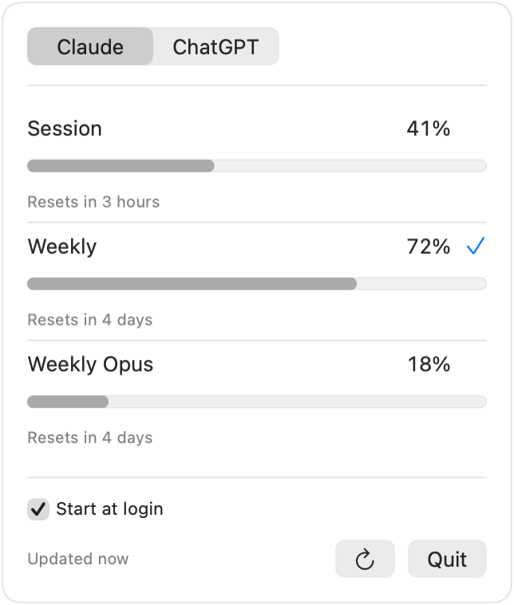
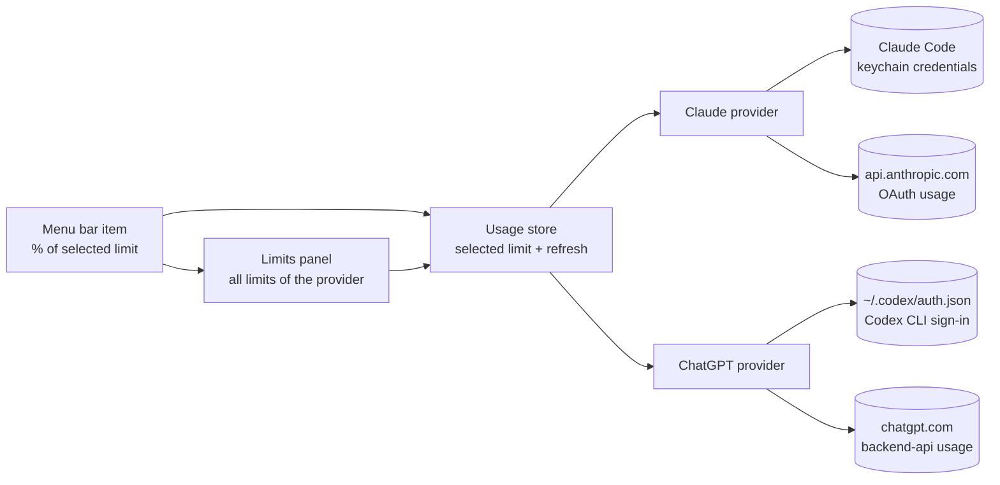
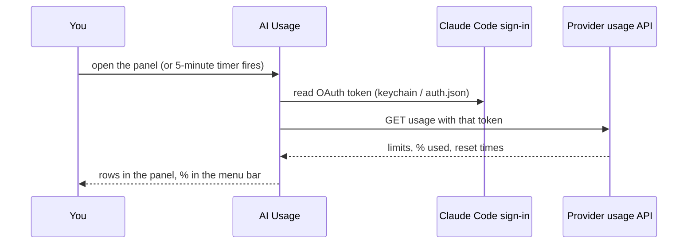
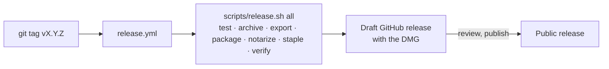

# AI Usage

A macOS menu bar app that shows how much of your Claude and ChatGPT usage
limits you've used.

Subscription plans come with limits that reset on their own clocks: a session
window here, a weekly cap there. The only way to check them is buried inside
each app. AI Usage keeps the one limit you care about in your menu bar as a
plain percentage, one click away from the full picture.

<p align="center">
  
</p>
<p align="center">
  <picture>
    <source media="(prefers-color-scheme: dark)" srcset="docs/panel-dark.png">
    
  </picture>
</p>

## ✨ Features

- 📊 **At-a-glance percentage** — the menu bar shows the % used of whichever limit you select
- 📋 **Full provider view** — click the item to see every limit of that provider, with usage and reset times
- 🔌 **Claude and ChatGPT** — reuses the sign-ins you already have; no API keys, no accounts, nothing to configure
- 🔄 **Always fresh** — limits refresh in the background and whenever you open the panel
- 🚪 **Starts at login** — optional, one checkbox in the panel
- 🔒 **Local and private** — no telemetry, no server of its own; usage is read straight from Anthropic's and OpenAI's own endpoints

## 📦 Install

Requires macOS 14 (Sonoma) or later. The app is signed with a Developer ID and
notarized by Apple, so it opens without any Gatekeeper workaround.

**Homebrew**

```sh
brew install --cask sebastian-suarez/tap/ai-usage
```

**Direct download**

1. Download `AI-usage-<version>.dmg` from the [latest release](https://github.com/sebastian-suarez/ai-usage/releases/latest).
2. Open it and drag **AI usage** into **Applications**.
3. Launch it. It lives in the menu bar only: no Dock icon, no main window.

### Before first launch

AI Usage never asks you to sign in. It reads the usage limits through the
credentials of two tools you may already use, so make sure they are signed in
on this Mac:

| Provider | Reads the sign-in of | Notes |
| --- | --- | --- |
| Claude | [Claude Code](https://claude.com/claude-code) | Run `claude` once and sign in with your subscription |
| ChatGPT | [Codex CLI](https://github.com/openai/codex) | Sign in with ChatGPT, not with an API key |

On the first refresh macOS asks whether AI Usage may read Claude Code's
keychain item. Choose **Always Allow** so it doesn't ask again.

## 🏗️ How it works

A menu bar-only SwiftUI app: one provider module per subscription feeds a
shared usage store, and the UI just renders it. Nothing is persisted beyond
which limit you selected.





## 🛠️ Building from source

1. Open `AI usage.xcodeproj` in Xcode 26 or later.
2. Select the **AI usage** scheme and press **Run** (⌘R).

The unit tests run with `scripts/release.sh test`, or from Xcode with ⌘U.
`ENABLE_APP_SANDBOX` is intentionally off: the providers read another app's
keychain item and a dotfile in your home folder, which the sandbox forbids.

## 🚢 Releasing

Releases are cut by CI. Pushing a tag such as `v1.2.0` that matches the
project's `MARKETING_VERSION` runs `.github/workflows/release.yml`, which
builds, signs, notarizes and staples the DMG on a macOS runner and attaches it
to a **draft** GitHub release for review.



The same `scripts/release.sh` runs locally; `--help` documents every stage and
the notarization credentials it expects. CI needs five repository secrets:

| Secret | Contents |
| --- | --- |
| `DEVELOPER_ID_P12` | Base64 of the Developer ID Application certificate + private key (`.p12`) |
| `P12_PASSWORD` | Password the `.p12` was exported with |
| `ASC_KEY_P8` | Base64 of the App Store Connect API key (`AuthKey_*.p8`) |
| `ASC_KEY_ID` | The API key's ID |
| `ASC_ISSUER_ID` | The App Store Connect issuer ID |

## 🤖 How this project is built

The whole app was built with AI coding agents under a small, explicit process
that lives in the repo: `.project/board/` holds milestones and stories as
markdown files, `AGENTS.md` sets the rules every agent follows, and each story
goes plan → implement → review before it is marked done. Read `BOARD.md` for
what shipped and what's next.

## 📄 License

[MIT](LICENSE) © 2026 Sebastian Suarez
