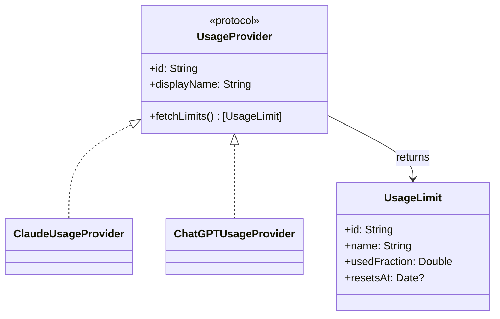

# Providers

Each subscription is one provider module. A provider knows two things: where the
local sign-in lives and which endpoint returns usage for it. Everything else
(selection, refresh, rendering) is shared.

## Claude

| | |
| --- | --- |
| Sign-in source | Claude Code's OAuth credentials: the `Claude Code-credentials` keychain item first, `~/.claude/.credentials.json` as fallback |
| How it is read | `/usr/bin/security find-generic-password` (this is what triggers the one-time keychain prompt) |
| Endpoint | `GET https://api.anthropic.com/api/oauth/usage` with the bearer token |
| Token expiry | If the stored token is already expired the provider reports "sign in again" instead of calling the API |

The response carries rolling windows that map to rows in the panel:

| API field | Row |
| --- | --- |
| `five_hour` | Session |
| `seven_day` | Weekly |
| `seven_day_opus` / `seven_day_sonnet` | Weekly (model) |
| `limits[]` with `kind` `session`, `weekly_all`, `weekly_scoped` | Same rows, newer response shape |

## ChatGPT

| | |
| --- | --- |
| Sign-in source | The Codex CLI's `~/.codex/auth.json`, which must contain a ChatGPT login (an API-key-only sign-in is rejected with a clear message) |
| Endpoint | `GET https://chatgpt.com/backend-api/wham/usage` with the bearer token and the `ChatGPT-Account-Id` header when present |
| Token expiry | Read from the JWT's `exp` claim |

Rate limits come as a primary and a secondary window (for example a 5-hour and a
weekly window), plus optional named limits such as code review. Each window
becomes one row; reset times are taken from `reset_at` or derived from
`reset_after_seconds`.

## Adding a provider

1. Add a type conforming to `UsageProvider` under `AI usage/Providers/<Name>/`.
2. Keep network and credential access behind injectable closures (see the
   `Transport` typealias in the existing providers) so tests never hit the network
   or the keychain.
3. Register it in `ProviderRegistry.defaultProviders()`.
4. Add response-parsing and provider tests next to the existing ones.
