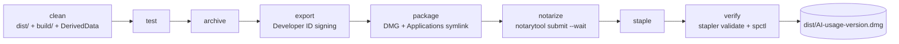

# Releasing

Releases are Developer ID-signed, notarized, stapled DMGs published on GitHub.
`scripts/release.sh` is the single implementation; CI only supplies credentials
and uploads the result.



## Cutting a release (CI)

1. Bump `MARKETING_VERSION` in the Xcode project in its own commit on `main`.
2. Tag and push:

   ```sh
   git tag -a v1.2.0 -m "AI Usage 1.2.0"
   git push origin v1.2.0
   ```

3. `.github/workflows/release.yml` checks the tag against `MARKETING_VERSION`,
   imports the certificate into a throwaway keychain, runs `scripts/release.sh all`
   and creates a **draft** release with the DMG attached. Re-running the
   workflow for the same tag replaces the DMG on that draft rather than adding
   another one; once the release is published the run fails instead, because a
   new DMG would no longer match the cask's `sha256`.
4. Review the draft, write the notes, publish.
5. Update the Homebrew cask (below).

Running the workflow manually from the Actions tab only performs a dry run. Use it
to check that the runner image still has the pinned Xcode.

### Repository secrets

| Secret | Contents |
| --- | --- |
| `DEVELOPER_ID_P12` | Base64 of the Developer ID Application certificate + private key (`.p12`) |
| `P12_PASSWORD` | Password the `.p12` was exported with |
| `ASC_KEY_P8` | Base64 of the App Store Connect API key (`AuthKey_*.p8`) |
| `ASC_KEY_ID` | The API key's ID |
| `ASC_ISSUER_ID` | The App Store Connect issuer ID (Users and Access → Integrations → Keys) |

Encode a file with `base64 -i <file> | gh secret set <NAME>`.

## Running the pipeline locally

The Developer ID Application certificate must be in the login keychain, and
`notarytool` needs a stored keychain profile holding the same App Store Connect
API key CI uses, so one notarization credential serves both paths:

```sh
xcrun notarytool store-credentials "notarytool-KGVLNXZJNX" \
  --key "<path-to-AuthKey.p8>" --key-id "<key-id>" --issuer "<issuer-id>"
```

Then:

```sh
scripts/release.sh all        # full pipeline, ends with dist/AI-usage-<version>.dmg
scripts/release.sh install    # replace /Applications/AI usage.app with that DMG
scripts/release.sh --help     # every stage, flag and prerequisite
```

Stages can run individually while their inputs exist (`test archive export
package` is a useful offline chain). `--dry-run` prints every command without
touching Apple, the network or the keychain.

## Homebrew cask

The cask lives in [`sebastian-suarez/homebrew-tap`](https://github.com/sebastian-suarez/homebrew-tap)
as `Casks/ai-usage.rb`. After publishing a release, update `version` and
`sha256`:

```sh
shasum -a 256 AI-usage-<version>.dmg
```

and push the tap. `brew upgrade --cask ai-usage` then picks it up.
